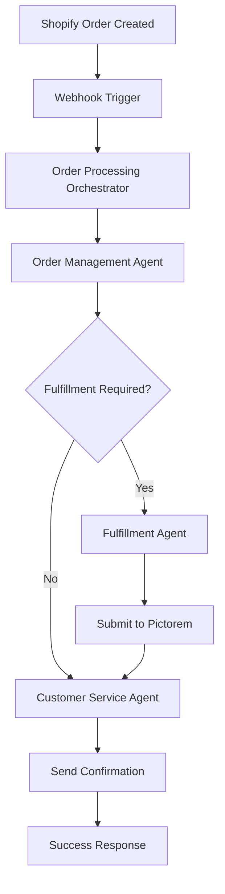

# VividWalls E-commerce Order Fulfillment System

A comprehensive multi-agent workflow system that automates order processing from Shopify to Pictorem using Model Context Protocol (MCP) servers and n8n.

## 🎯 System Overview

This system provides end-to-end automation for canvas print orders:

1. **Order Reception**: Shopify webhook triggers when new orders are created
2. **Order Processing**: AI agents analyze and validate order data
3. **Fulfillment**: Automated submission to Pictorem for printing
4. **Customer Service**: Automated notifications and order tracking

## 🏗️ Architecture

### Components

1. **Shopify MCP Server** - Provides tools for Shopify API operations
2. **Pictorem MCP Server** - Handles print fulfillment operations  
3. **n8n Workflow** - Orchestrates the multi-agent system
4. **AI Agents** - Specialized agents for different responsibilities

### Agent Responsibilities

#### 1. Order Management Agent
- **Purpose**: Primary order processing and coordination
- **Tools Access**: Shopify MCP + Pictorem MCP
- **Responsibilities**:
  - Monitor incoming Shopify orders
  - Extract order details and customer information
  - Validate product specifications for print readiness
  - Calculate accurate pricing with markups and discounts
  - Coordinate with Fulfillment Agent for Pictorem processing
  - Update order status in Shopify

#### 2. Fulfillment Agent  
- **Purpose**: Specialized Pictorem order processing
- **Tools Access**: Pictorem MCP + Email notifications
- **Responsibilities**:
  - Process order data from Order Management Agent
  - Configure product specifications (canvas type, size, frames)
  - Handle image upload and validation
  - Submit orders to Pictorem with authentication
  - Apply VividWalls markup and Pro discounts
  - Track order status and provide updates

#### 3. Customer Service Agent
- **Purpose**: Customer communications and support
- **Tools Access**: Shopify MCP + Email system
- **Responsibilities**:
  - Send order confirmation emails
  - Provide order tracking information
  - Handle customer service inquiries
  - Process refunds and returns when necessary
  - Update customer records in Shopify

## 🔧 MCP Server Tools

### Shopify MCP Server Tools

**Product Management:**
- `get-products` - Get all products or search by title
- `get-products-by-collection` - Get products from specific collections
- `get-products-by-ids` - Get products by IDs
- `get-variants-by-ids` - Get product variants by IDs

**Order Management:**
- `get-orders` - Get orders with advanced filtering
- `get-order` - Get single order by ID
- `create-draft-order` - Create draft orders
- `complete-draft-order` - Complete draft orders

**Customer Management:**
- `get-customers` - Get customer data with pagination
- `tag-customer` - Add tags to customers

**Store Operations:**
- `get-shop` - Get basic shop details
- `get-shop-details` - Get extended shop information
- `get-collections` - Get product collections

**Marketing:**
- `create-discount` - Create discount codes
- `manage-webhook` - Subscribe/manage webhooks

### Pictorem MCP Server Tools

**Order Processing:**
- `submit-order` - Submit complete print orders to Pictorem
- `get-order-status` - Check order status and tracking
- `calculate-pricing` - Calculate VividWalls pricing with markups

**Image Management:**
- `upload-image` - Upload images for print orders

## 💰 Pricing Logic

The system implements VividWalls' specific pricing structure:

```javascript
// Base Pictorem pricing
const basePrice = getPictoremPrice(size, productType);

// Apply Pro account discount (15%)
const proDiscount = 0.15;

// Apply canvas roll discount (25% additional)
const canvasRollDiscount = productType === "canvas_roll" ? 0.25 : 0;

// Total discount
const totalDiscount = proDiscount + canvasRollDiscount;
const discountedPrice = basePrice * (1 - totalDiscount);

// Apply VividWalls markup (106.5%)
const vividwallsMarkup = 2.065;
const finalPrice = discountedPrice * vividwallsMarkup;
```

## 📊 Data Flow

### Order Processing Flow



### Data Structure

The system processes orders according to the [Pictorem Data Package Schema](../pictorem-data-package.md):

```json
{
  "order": {
    "shopify_order_id": "string",
    "order_number": "string",
    "customer_info": { ... }
  },
  "product_configuration": {
    "product_type": "canvas|framed|canvas_roll|...",
    "size": { "width": "number", "height": "number" },
    "canvas_type": "stretched|roll",
    "frame_options": { ... }
  },
  "image_data": { ... },
  "pricing": { ... },
  "authentication": { ... }
}
```

## 🚀 Deployment

### Prerequisites

- Digital Ocean droplet with Docker and Docker Compose
- n8n instance running in Docker
- Shopify store with API access
- Pictorem Pro account credentials

### Installation Steps

1. **Deploy the system:**
   ```bash
   chmod +x scripts/deploy-mcp-servers-and-workflow.sh
   ./scripts/deploy-mcp-servers-and-workflow.sh
   ```

2. **Configure environment variables:**
   ```bash
   # Set Shopify credentials
   export SHOPIFY_ACCESS_TOKEN="your-shopify-access-token"
   export MYSHOPIFY_DOMAIN="yourstore.myshopify.com"
   ```

3. **Set up Shopify webhook:**
   ```bash
   node /root/vivid_mas/scripts/setup-shopify-webhook.js
   ```

4. **Verify installation:**
   ```bash
   # Check n8n logs
   docker logs vivid_mas-n8n-1 -f
   
   # Test MCP servers
   cd /root/vivid_mas/mcp
   echo '{"jsonrpc": "2.0", "id": 1, "method": "tools/list", "params": {}}' | node shopify-mcp-server/dist/index.js
   ```

## 🎮 Usage

### Accessing the System

- **n8n Interface**: https://n8n.vividwalls.blog
- **Chat Interface**: Available within the workflow for customer service
- **Webhook Endpoint**: https://n8n.vividwalls.blog/webhook/shopify-order-webhook

### Testing the Workflow

1. **Create a test order in Shopify**
2. **Monitor n8n execution logs**
3. **Check order status in Pictorem**
4. **Verify customer notifications**

### Manual Agent Interaction

You can interact with individual agents through the n8n chat interface:

```
# Order Management Agent
"Check the status of order #1001"
"Process pending orders from today"

# Fulfillment Agent  
"Submit order to Pictorem with canvas 24x16"
"Check Pictorem order status for order ID 12345"

# Customer Service Agent
"Send tracking update to customer for order #1001"
"Handle refund request for order #1002"
```

## 🔧 Configuration

### MCP Server Configuration

**Shopify MCP Server** (`/root/vivid_mas/mcp/shopify-mcp-server/.env`):
```bash
SHOPIFY_ACCESS_TOKEN=your-shopify-access-token
MYSHOPIFY_DOMAIN=yourstore.myshopify.com
```

**Pictorem MCP Server** (`/root/vivid_mas/mcp/pictorem-mcp-server/.env`):
```bash
PICTOREM_USERNAME=kingler@me.com
PICTOREM_PASSWORD=REDACTED_SET_PICTOREM_PASSWORD_ENV
```

### n8n Environment Variables

```bash
N8N_COMMUNITY_PACKAGES_ALLOW_TOOL_USAGE=true
OPENAI_API_KEY=your-openai-api-key
POSTGRES_PASSWORD=your-postgres-password
```

## 🔍 Monitoring & Debugging

### Log Locations

```bash
# n8n container logs
docker logs vivid_mas-n8n-1 -f

# Workflow execution logs
# Available through n8n interface at https://n8n.vividwalls.blog

# MCP server logs
# Logged to stderr when servers are running
```

### Common Issues

1. **MCP Server Connection Errors**
   - Check if Node.js and required packages are installed
   - Verify environment variables are set correctly
   - Ensure MCP servers are built and executable

2. **n8n Community Node Issues**
   - Verify `N8N_COMMUNITY_PACKAGES_ALLOW_TOOL_USAGE=true` is set
   - Restart n8n container after installing community nodes
   - Check n8n logs for package loading errors

3. **Shopify Webhook Issues**
   - Verify webhook URL is accessible from Shopify
   - Check webhook subscription in Shopify admin
   - Test webhook endpoint manually

## 🛡️ Security Considerations

### API Key Management
- All API keys stored as environment variables
- Credentials encrypted in n8n database
- Access logs monitored for unauthorized usage

### Network Security
- HTTPS enforced for all webhook endpoints
- Shopify webhook signature verification recommended
- Rate limiting on API endpoints

### Data Privacy
- Customer data processed according to GDPR/privacy requirements
- Order data encrypted in transit and at rest
- Audit logs maintained for compliance

## 📈 Performance Optimization

### Scaling Considerations

1. **MCP Server Performance**
   - Run multiple MCP server instances for high load
   - Implement connection pooling for database operations
   - Cache frequently accessed data

2. **n8n Workflow Optimization**
   - Use sub-workflows for complex operations
   - Implement proper error handling and retries
   - Monitor execution time and optimize bottlenecks

3. **Database Performance**
   - Index frequently queried fields
   - Regular database maintenance
   - Consider read replicas for analytics

## 🔄 Maintenance

### Regular Tasks

1. **Weekly**
   - Review error logs and failed executions
   - Monitor Pictorem order success rates
   - Check webhook delivery status

2. **Monthly**
   - Update MCP server dependencies
   - Review and optimize pricing calculations
   - Analyze customer service metrics

3. **Quarterly**
   - Security audit of API access and credentials
   - Performance review and optimization
   - Backup verification and disaster recovery testing

## 📚 API References

- [Shopify Admin API](https://shopify.dev/docs/api/admin)
- [n8n Documentation](https://docs.n8n.io/)
- [Model Context Protocol](https://modelcontextprotocol.io/)
- [n8n MCP Client Node](https://www.npmjs.com/package/n8n-nodes-mcp)

## 🆘 Support & Troubleshooting

### Error Resolution

For common errors and their solutions, see:
1. Check MCP server logs for authentication issues
2. Verify n8n workflow execution logs
3. Test individual tools using MCP client
4. Contact support with detailed error logs

### Contact Information

- **Technical Support**: Support through workflow logs and documentation
- **System Administrator**: Server access via SSH to droplet
- **Business Logic**: Refer to Pictorem data package documentation

---

**System Status**: ✅ Deployed and Operational  
**Last Updated**: January 2024  
**Version**: 1.0.0 